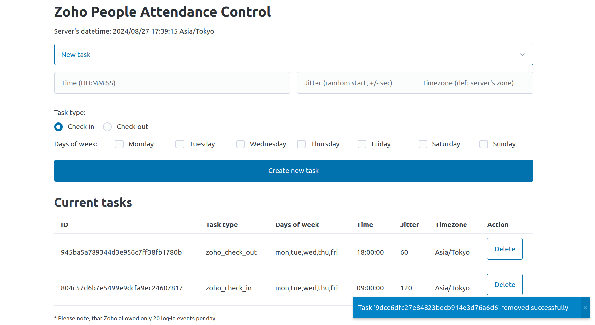

Zoho People Attendance Control
============

:star2: [Features](#star2-features) | :pushpin: [What and why](#pushpin-what-and-why) | :gear: [Setup and run](#gear-setup-and-run) | :spiral_notepad: [Known issues](#spiral\_notepad-known-issues) | :scroll: [License](#scroll-license)



Automate check-in/check-out for Zoho People with a modern, self-hosted web application.

<!-- Features -->
:star2: Features
---------------

- Zoho People automated check-in/check-out powered by Playwright;
- Built-in scheduler for check-in/check-out tasks. Support for random start time range (jitter), time zone control;
- Modern, mobile-friendly web application with nice backend notifications! Check in with style!
- Self-hosted ready: pre-built Docker image, Docker Compose configuration, password protection for UI;

<!-- What and why -->
:pushpin: What and why
---------------

Simple but powerful and flexible web application that handles only two tasks: check-in to Zoho People and check-out from Zoho People. Task scheduler allows you to plan check-in/check-out tasks for the whole week. Random range for tasks start supported to not let your boss know that some sort of automation is in use. Modern web application powered frontend part to let schedule and remove tasks as easy as possible. Experimental password protection has been implemented for long-term self-hosted use. Plan your working day, start your work easily and never forget to check out again! :wink:

This application grew out of an idea for a simple script to help me remember to check in/out of Zoho People at my current company. I really don't like micro-controlling, especially when it's pretty pointless, and I like to automate things. So, one evening it was decided - a simple script for presence control. I will use [Playwright](https://github.com/microsoft/playwright) to automate the browser part, which I already know well enough. I'll use [APScheduler](https://github.com/agronholm/apscheduler) as scheduler package - it's stable, flexible and has support for task storage from box. I also found the [FastHX](https://github.com/volfpeter/fasthx) project, which should help me to build HTMX-API pretty quickly. Future spoilers: FastHX was ok and gives me a good start, but I found that raw [FastAPI](https://github.com/fastapi/fastapi)+[Jinja2](https://github.com/pallets/jinja/) is more flexible for my tasks. Docker here, JS libs there and my workday helper is ready!

This project is in many ways a showcase and experimental playground for me. I really like Python and automating things. My constant pain is the lack of good UI support from Python itself. [HTMX](https://github.com/bigskysoftware/htmx) is all the rage these days, so I decided to take a look. As a result, I am using HTMX a lot in this project and I like it so far! I hope to use this project template and ideas in future projects. To build the frontend, I used HTMX for backend communication, [PicoCSS](https://github.com/picocss/pico) as a micro-CSS framework to build layout quickly, [Notyf](https://github.com/caroso1222/notyf) JS library to handle notifications, [just-validate](https://github.com/horprogs/Just-validate) to validate forms before submitting ('login' and 'new task' forms). I also experimented with LLM code generation while building this project - I found that LLM is pretty good at generating code from scratch, but not so good and messy when editing existing code or when you need to change the implementation. Still, the AI helps me a lot to quickly build password protection for the app, as well as JS and HTMX elements for templates. I had a lot of fun building this project and I hope you have a lot of fun using it or taking elements from these projects to build something new. Have fun and take care!

<!-- Setup and run -->
:gear: Setup and run
---------------

## Configuration

Before starting the application, please prepare a valid .env file with application parameters.

- Make a copy of the example .env file:

`cp .env.example .env`

- Edit .env following the comments inside the file:

`code .env`

## Running
### Docker Compose (Recommended)
The easiest way to run the application is to use Docker Compose.

If you want the application to use the server's timezone and local time, you can uncomment these few lines:

```
    #- /etc/timezone:/etc/timezone:ro
    #- /etc/localtime:/etc/localtime:ro
```

- To create the application container:

`docker compose build`

- Run the application with Docker Compose:

`docker compose up -d --force-recreate`

### Docker
Running from a docker image can give more flexibility. Building your own container is also a way to change the default timezone within the container.

- To create a container with custom args:

`docker build --build-arg APP_PORT=9898 --build-arg APP_TIMEZONE=Asia/Tokyo -t attctrl:latest .`

- To run an application with a built image:

`docker run --env-file .env -p 9898:9898 attctrl:latest`

### Python
Application can be started without Docker. The use of Python venv is recommended.

- Install the required packages in the Python environment:

`pip install .`

- To launch the application using FastAPI:

`fastapi run --port 9898 src/attctrl/main.py`

#### Rye
If you are using the Rye package manager:

- Prepare the venv environment:

`rye sync`

- To launch the application using FastAPI:

`rye run start-prod`

### Development
Use the `DEBUG=true` env variable to run the Playwright browser automation in headed mode.

- Install the required packages in the Python environment:

`pip install -e .`

- To launch the application using FastAPI:

`fastapi dev --port 9898 --reload src/attctrl/main.py`

#### Rye
If you are using the Rye package manager:

- Prepare the venv environment:

`rye sync`

- To launch the application using FastAPI:

`rye run start-dev`

<!-- Known issues -->
:spiral_notepad: Known issues
---------------

- [ ] Zoho People portal have some tricky layout and like to trow additional windows and confirmation requests, so in some cases browser automation may not be as stable;
- [ ] Zoho People portal seems to have 20 login limits per day and some additional protection, so it will be good not to overuse it on daily basis;
- [ ] You schedule start of check-in/check-out task in application and each task has some time (usually 2-5 minutes) to complete. Will be good not to set tasks too close together;

<!-- License -->
:scroll: License
---------------

Distributed under the [MIT License](https://spdx.org/licenses/MIT.html) license. See LICENSE for more information.
